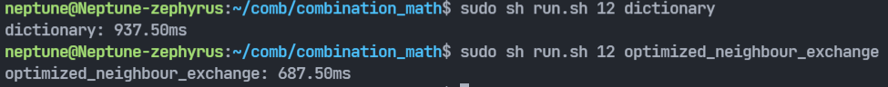
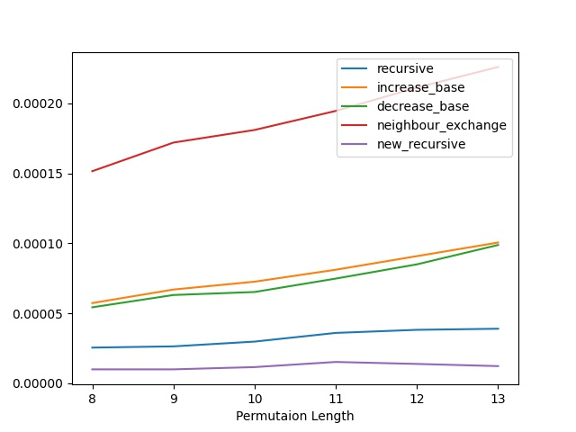

# 组合数学全排列项目报告

> 2021310775 陈海天 2021310754 潘俊臣

## 四种全排列算法及其改进

### 递增进制数法

- 原算法流程：
  
  维护递增进制中介数，每迭代一次，按照递增进制原则给中介数加一。

  每迭代一次，按照定义转换中介数至实际排列。从高位开始确定数字位置，当前数字i对应的位置是从低位开始数$a_i$个空位后的下一个位置。(实现中使用了类似链表的指向性结构维护空位)

- 优化后算法：
  
  维护递增进制中介数，每迭代一次，按照递增进制原则给中介数加一。

  考虑加一的过程中，产生变化的位$a_k..a_2$，影响的数字是$1-k$，更大的数字对应的中介数值没有被影响。那么按照定义转换，由于更大的数字先放，所以更大的数字位置不变，那么实际上迭代一次后的排列可以由原排列修改$k$位后得到。具体来说，算法需要维护每一个数字所在的位置，每次中介数尾数的$(k-1)$位发生变化，就要修改$k$个位置上的数的相对顺序，其中最大的$k$应该被提前到原先顺位的前一个，其余的$(k-1)$个数应该按照从小到大排列在剩下的位置上。

  举例：$(3221)↑->(3300)↑$对应排列：$35421->45123$。观察中介数尾数有$3$位改变，则本次迭代影响$1-4$的位置，也就是$5$的位置不变，$4$向前一位替代$3$，剩下的三个空位给$1-3$按照从小到大排序。

### 递减进制数法

- 原算法流程：
  
  维护递减进制中介数，每迭代一次，按照递减进制原则给中介数加一。

  每迭代一次，按照定义转换中介数至实际排列。从高位开始确定数字位置，当前数字i对应的位置是从低位开始数$a_i$个空位后的下一个位置。(实现中使用了类似链表的指向性结构维护空位)

- 优化后算法：
  
  维护递减进制中介数，每迭代一次，按照递减进制原则给中介数加一。

  考虑加一的过程中，产生变化的位$a_k..a_n$，影响的数字是$k-n$，更小的数字对应的中介数值没有被影响(也就是相对位置不变)。而由于进位，所以$(k+1)-n$对应的中介数的值必然是从最大值归零，所以迭代前$(k+1)-n$这几个数必然降序排列在最高位，而迭代后必然增序排列在最低位。而对于$k$来说，其中介数的值增加了一，$(k+1)-n$的位置不影响$k$的相对位置，所以$k$只需要在$1-k$的子排列中向前挪动一位。

  举例：$(1134)↓->(1200)↓$对应排列：$54231->32145$。观察中介数尾数有$3$位改变，则本次迭代影响$3-5$的位置，此时处在开头的$54$迭代后会呈增序$45$排列在尾部，$3$则在子排列$231$中向前一位变为$321$，加上尾部的$45$，构成新排列$32145$。

### 邻位对换法

- 原算法流程：
  
  维护递减进制中介数，每迭代一次，按照递减进制原则给中介数加一。

  每迭代一次，按照邻位对换法中介数转换的定义求解一次。对于大于$2$的位：从高位到低位，如果当前数$i$是奇数，就检测中介数$i-1$位的奇偶性，如果当前数i是偶数，就检测中介数$i-1$位加上$i-2$位的奇偶性，奇向右，偶向左，定义当前数的方向。对于方向向右的位，算法从$1$扫描到$N$，维护扫描过的空位数，空位数和当前位$i$的中介数相同时，将当前数填入下一个空位，方向向左的位，算法则从$N$扫描到$1$。对于特殊的$2$和$1$，$2$被定义为向左，从$N$到$1$扫描求解，$1$则填入最终的空位。

- 优化后算法：
  
  维护递减进制中介数，每迭代一次，按照递减进制原则给中介数加一。
  
  缓存最大元素当前的位置和移动方向，当中介数未进位时，直接沿用当前的位置和方向。当中介数进位时，找到最大的未进位的元素，根据中介数计算出其方向并移动(具体实现使用位运算快速计算)。同时更新最大元素的位置和方向。

### 字典序法

- 算法流程：
  
  每次迭代，从低位开始向高位搜索，找到第一个降序点(即高位值$a_i$小于低位值$a_{i-1}$)。再从低位到高位搜索，找到第一个大于$a_i$的值$a_j$，交换二者。最后将降序点后的序列翻转，就得到了迭代后的序列

### 复杂度分析

1. 如果上述四种算法不进行优化，严格按照中介数的生成规则来进行转换，每次递归的复杂度都是 $O(n)$的，那么易知总体复杂度为 $O(n \times n!)$。

2. 递增进制数法和字典序使用的中介数都是递增进制，复杂度十分类似。设每次递归进了 $k$ 位，在优化之后我们可以做到每次递归的复杂度为 $O(k)$，所以总体复杂度为：

$$
\sum\limits_{k=1}^{n} \frac{n!}{k!}(k-1)O(k) = O(n!) \sum\limits_{k=1}^{n} \frac{k(k-1)}{k!} = O(n!)
$$

3. 递减进制数法和邻位交换法使用的中介数都是递减进制，复杂度十分类似。设每次递归进了 $k$ 位，在优化之后我们可以做到每次递归的均摊复杂度为 $O(n-k)$，所以总体复杂度为：

$$
\sum\limits_{k=1}^{n-1} k!O(n-k) = O(n!)\sum\limits_{k=1}^{n-1} \frac{k!(n-k)}{n!} = O(n!)
$$

## 课程外全排列算法
### Heap's algorithm

- 算法流程：
  
  一种全排列生成算法，于1963年被B.R.Heap提出，目标是利用尽可能少的移动数来生成全排列。

  算法每一层都保证$k+1$位及之后的排列不变，而对前面的元素做全排列。具体来说，当$k$是奇数时，就重复交换最后一个和第一个元素，因为$k$为奇数时，$(k-1)$层的Heap全排列会使得前$(k-1)$个数次序相比初始状态循环右移一位。而$k$是偶数时，每次交换最后一个和第$i$个元素$(i=1...(k-1))$，因为$k$为偶数时，$(k-1)$层的Heap全排列会使得前$(k-1)$个数次序保持不变。

### 新式递归法

- 算法流程：
  
  递归式算法中，每一层迭代算法都会从$1$尝试到$N$，并借助一个标记数组来确定之前的层有没有用过相同的元素，最终生成一个按照字典序的全排列。所以层数$N*$每层尝试次数$N$，递归式算法的复杂度是$O(N^N)$

  设计的新递归算法则维护一个可用集合，避免了每层探测N次(其中的很多尝试都是无用功，因为上层已经用过了)。具体来说，新算法维持一个$1-N$的可用元素集合，作为每次探索的候选。每层递归都会使得集合的元素减少一个，而从递归返回则会使得集合的元素增加回来。在实际的实现中，我们利用全局的数组和边界标记变量实现了这个可用元素集合。每次用掉一个元素，就将他与边界上的元素换位，并将边界左移一个元素，释放一个元素则反之。这种新设计使得每迭代一层，可选元素少一个，最终的时间复杂度就是$O(N!)$。

  新算法的复杂度是比原先版本低的，但是由于枚举逻辑不同，会导致生成的序列不完全一致，所以我们将其列为一种新递归算法而不是递归算法优化版本。

### 复杂度分析

1. `Heap`算法每次递归中的操作都是 $O(1)$的，所以其复杂度为 $O(n!)$。

2. 新式递归法将递归法原本每层$N$次的尝试降低到了$(N - i)$次（$i$是层数），所以原本的$O(N^N)$变为$O(N!)$

## 运行效果对比

### 单次运行效果



注：以字典序和优化的邻位对换算法为例，所有算法名称列表在仓库说明部分

### 算法运行效率对比

由于算法的运行效率差距较大，同时将所有的算法绘制在一张图中会导致难以分辨。所以我们将较慢的递归，新递归，递增进制数法，递减进制数法，邻位对换法画在一张图中，将较快的STL，优化递增进制数法，优化递减进制数法，优化邻位对换法，字典序法，heap法画在了一张图中。

根据报告上文中的分析，这几种算法的复杂度归纳为$O(N*N!)$（未优化的四种算法），$O(N^N)$（递归），$O(N!)$（新递归，优化后的四种算法，heap算法）。为了更好的对比几种算法的区别，我们将各个算法在各个排列长度下的10次平均运行时间**除以对应长度的阶乘**，得到了如下两张效率对比图。

- 较慢的算法对比图：



将较慢的几种算法，在长度为$8-13$的排列上运行了10次求平均时间开销，并除以对应长度的阶乘。

可以明显发现，未优化的邻位对换、未优化的递增进制数和未优化的递减进制数（复杂度皆为$O(N*N!)$）对应的曲线有明显的上升趋势，而递归$O(N^N)$和新递归$O(N!)$则没有明显的上升趋势，验证了算法复杂度的分析。

- 较快的算法对比图：


将较快的几种算法，在长度为$8-14$的排列上运行了10次求平均时间开销，并除以对应长度的阶乘。

可以明显发现，本图中的各个曲线都没有明显的上升趋势，体现出各个算法的复杂度都是$O(N!)$，验证了算法复杂度的分析。同时我们发现STL的运行时间也基本满足复杂度为$O(N!)$的特征。

四种课程内算法(优化后)性能从高到低排序大致为邻位对换，字典序，递减进制数，递增进制数。另外针对各个版本的调优和重新设计，性能提升也很明显。以长度为12的全排列为例，运行时间开销如下表所示。

| 算法名称 | 运行时间(ms) |
|-|-|
| STL next_permutation | 1710.91 |
|Recursive| 9090.34|
|Increase_base| 43855.91 |
|Optimized_increase_base| 1965.40|
|Decrease_base| 42827.44|
|Optimized_decrease_base| 1383.25|
|Neighbour_exchange| 50748.60|
|Optimized_neighbour_exchange| 750.85|
|Dictionary| 1021.66|
|Heap's algorithm| 2310.80|
|New_recursive| 5507.32|

## 仓库说明

```
fig/				// 报告内用到的图片
result/				// 测试结果的JSON文件，保存算法用时的平均值
report.md			// 报告markdown源码
report.pdf			// 生成的PDF报告
main.cpp			// 代码
run.sh				// 运行编译脚本
performance_test.py // 性能测试脚本
```

- main.cpp

  内有报告中描述的所有算法的源码，按照报告所述的顺序排列(STL和基础递归作为对比排在开头)。依次为：
  - STL：`next_permutation()`
  - 递归法：`recursive()`
  - 递增进制数法：`increase_base()`，
  - 优化递增进制数法：`optimized_increase_base()`
  - 递减进制数法：`decrease_base()`
  - 优化递减进制数法：`optimized_decrease_base()`
  - 邻位对换法：`neighbor_exchange()`
  - 优化邻位对换法：`optimized_neighbor_exchange()`
  - 字典序法：`dictionary()`
  - Heap's algorithm：`heap()`
  - 新式递归法：`new_recursive()`

  以上的算法函数名，同时也是算法的标识，用于单次运行时指定算法。

  所有算法的输出可以通过取消`//# define SHOW`的注释打开，重新编译运行即可查看对应结果。（默认关闭）

- run.sh

  编译运行单次脚本，控制台`sh run.sh n algorithm_name`运行，`n`是目标排列长度，`algorithm_name`是方法对应的名称(同`main.cpp`部分解释)。脚本运行算法，首先会重新编译，运行效果与上部分截图一致。(编译后会生成build文件夹存放可执行文件)

- performance_test.py
  
  性能测试脚本，调用`run.sh`进行性能的测试，并输出测试结果。默认运行设置与上一部分中的效果对比相同，部分较慢的算法运行长度为8-13的结果，较快的则运行8-14。每个算法运行10次求平均耗时，最终绘制为上部分截图。

## 小组分工

陈海天：递归法、STL、字典序法、优化递减进制数法、优化邻位对换法、Heap's algorithm、新式递归法的编写，代码效率调优。

潘俊臣：递减进制数法、递增进制数法、邻位对换法、优化递增进制数法的编写，代码整理和注释，报告撰写。