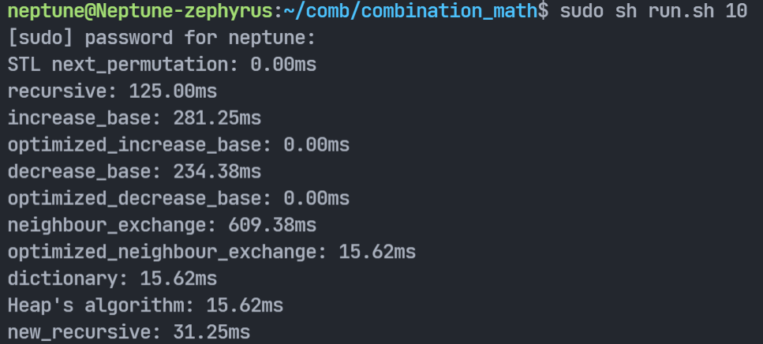
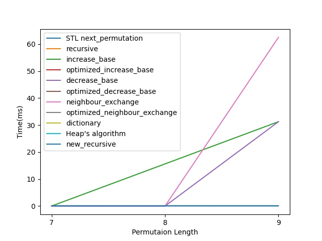

# 组合数学全排列项目报告
##### 2021 陈海天 2021310754 潘俊臣
## 四种全排列算法及其改进
### 递增进制数法
- 原算法流程：
  
  维护递增进制中介数，每迭代一次，按照递增进制原则给中介数加一。

  每迭代一次，按照定义转换中介数至实际排列。从高位开始确定数字位置，当前数字i对应的位置是从低位开始数ai个空位后的下一个位置。(实现中使用了类似链表的指向性结构维护空位)

- 优化后算法：
  
  维护递增进制中介数，每迭代一次，按照递增进制原则给中介数加一。

  考虑加一的过程中，产生变化的位ak..a2，影响的数字是1-k，更大的数字对应的中介数值没有被影响。那么按照定义转换，由于更大的数字先放，所以更大的数字位置不变，那么实际上迭代一次后的排列可以由原排列修改k位后得到。具体来说，算法需要维护每一个数字所在的位置，每次中介数尾数的(k-1)位发生变化，就要修改k个位置上的数的相对顺序，其中最大的k应该被提前到原先顺位的前一个，其余的(k-1)个数应该按照从小到大排列在剩下的位置上。

  举例：(3221)↑->(3300)↑对应排列：35421->45123。观察中介数尾数有3位改变，则本次迭代影响1-4的位置，也就是5的位置不变，4向前一位替代3，剩下的三个空位给1-3按照从小到大排序。

### 递减进制数法

- 原算法流程：
  
  维护递减进制中介数，每迭代一次，按照递减进制原则给中介数加一。

  每迭代一次，按照定义转换中介数至实际排列。从高位开始确定数字位置，当前数字i对应的位置是从低位开始数ai个空位后的下一个位置。(实现中使用了类似链表的指向性结构维护空位)

- 优化后算法：
  
  维护递减进制中介数，每迭代一次，按照递减进制原则给中介数加一。

  考虑加一的过程中，产生变化的位ak..an，影响的数字是k-n，更小的数字对应的中介数值没有被影响(也就是相对位置不变)。而由于进位，所以(k+1)-n对应的中介数的值必然是从最大值归零，所以迭代前(k+1)-n这几个数必然降序排列在最高位，而迭代后必然增序排列在最低位。而对于k来说，其中介数的值增加了一，(k+1)-n的位置不影响k的相对位置，所以k只需要在1-k的子排列中向前挪动一位。

  举例：(1134)↓->(1200)↓对应排列：54231->32145。观察中介数尾数有3位改变，则本次迭代影响3-5的位置，此时处在开头的54迭代后会呈增序45排列在尾部，3则在子排列231中向前一位变为321，加上尾部的45，构成新排列32145。

### 邻位对换法

- 原算法流程：
  
  维护递减进制中介数，每迭代一次，按照递减进制原则给中介数加一。

  每迭代一次，按照邻位对换法中介数转换的定义求解一次。对于大于2的位：从高位到低位，如果当前数i是奇数，就检测中介数i-1位的奇偶性，如果当前数i是偶数，就检测中介数i-1位加上i-2位的奇偶性，奇向右，偶向左，定义当前数的方向。对于方向向右的位，算法从1扫描到N，维护扫描过的空位数，空位数和当前位i的中介数相同时，将当前数填入下一个空位，方向向左的位，算法则从N扫描到1。对于特殊的2和1，2被定义为向左，从N到1扫描求解，1则填入最终的空位。

- 优化后算法：
  
  TODO

### 字典序法

- 算法流程：
  
  每次迭代，从低位开始向高位搜索，找到第一个降序点(即高位值ai小于低位值ai-1)。再从低位到高位搜索，找到第一个大于ai的值aj，交换二者。最后将降序点后的序列翻转，就得到了迭代后的序列

## 课程外全排列算法
### Heap's algorithm

- 算法流程：
  
  一种全排列生成算法，于1963年被B.R.Heap提出，目标是利用尽可能少的移动数来生成全排列。

  算法每一层都保证k+1位及之后的排列不变，而对前面的元素做全排列。具体来说，当k是奇数时，就重复交换最后一个和第一个元素，因为k为奇数时，(k-1)层的Heap全排列会使得前(k-1)个数次序相比初始状态循环右移一位。而k是偶数时，每次交换最后一个和第i个元素(i=1...(k-1))，因为k为偶数时，(k-1)层的Heap全排列会使得前(k-1)个数次序保持不变。

### 新式递归法

- 算法流程：
  
  递归式算法中，每一层迭代算法都会从1尝试到N，并借助一个标记数组来确定之前的层有没有用过相同的元素，最终生成一个按照字典序的全排列。所以层数N*每层尝试次数N，递归式算法的复杂度是O(N^N)

  设计的新递归算法则维护一个可用集合，避免了每层探测N次(其中的很多尝试都是无用功，因为上层已经用过了)。具体来说，新算法维持一个1-N的可用元素集合，作为每次探索的候选。每层递归都会使得集合的元素减少一个，而从递归返回则会使得集合的元素增加回来。在实际的实现中，我们利用全局的数组和边界标记变量实现了这个可用元素集合。每次用掉一个元素，就将他与边界上的元素换位，并将边界左移一个元素，释放一个元素则反之。这种新设计使得每迭代一层，可选元素少一个，最终的时间复杂度就是O(N!)。

  新算法的复杂度是比原先版本低的，但是由于枚举逻辑不同，会导致生成的序列不完全一致，所以我们将其列为一种新递归算法而不是递归算法优化版本。

## 运行效果对比及仓库说明

### 效果对比





在去掉输出时间的情况下，对上述报告中提到的所有算法做了性能的测试。图一展示了单词运行的效果，图二则展示了运行时间随序列长度的增长规律。

四种课程内算法(优化后)性能从高到低排序大致为邻位对换，递减进制数，字典序，递增进制数，均快于STL版本。另外针对各个版本的调优和重新设计，性能提升也很明显。

### 仓库说明

```
fig/		// 报告内用到的图片
report.md	// 报告markdown源码
report.pdf	// 生成的PDF报告
main.cpp	// 代码
run.sh		// 运行编译脚本
```

- main.cpp

  内有报告中描述的所有算法的源码，按照报告所述的顺序排列(STL和基础递归作为对比排在开头)。依次为：STL`next_permutation()`，递归法`recursive()`，递增进制数法`increase_base()`， 优化递增进制数法`optimized_increase_base()`，递减进制数法`decrease_base()`，优化递减进制数法`optimized_decrease_base()`，邻位对换法`neighbor_exchange()`，优化邻位对换法`optimized_neighbor_exchange()`，字典序法`dictionary()`，Heap's algorithm`heap()`，新式递归法`new_recursive()`。

  所有算法的输出可以通过取消`//# define SHOW`的注释打开，重新编译运行即可查看对应结果。（默认关闭）

- run.sh

  编译运行脚本，控制台`sh run.sh n`运行，`n`是目标排列长度。脚本运行所有算法，效果与上部分截图一致。(编译后会生成build文件夹存放可执行文件)

- performance_test.py
  
  性能测试脚本，调用`run.sh`进行性能的测试，并输出测试结果。默认运行8-13长度的排列，各个算法的用时，每个算法运行10次求平均耗时，最终绘制为上部分截图。

## 小组分工

陈海天：递归法、STL、字典序法、优化递减进制数法、优化邻位对换法、Heap's algorithm、新式递归法的编写，代码效率调优。

潘俊臣：递减进制数法、递增进制数法、邻位对换法、优化递增进制数法的编写，代码整理和注释，报告撰写。